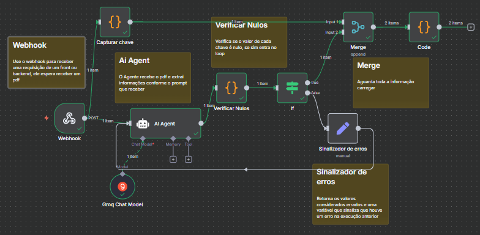
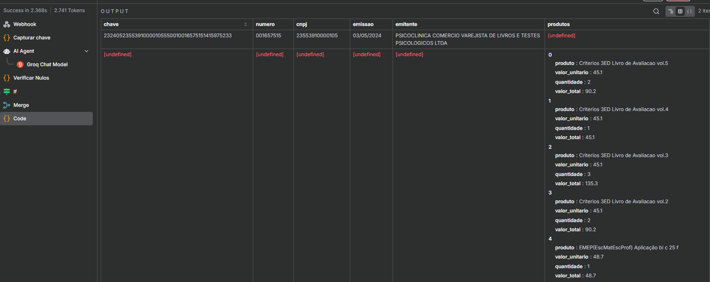
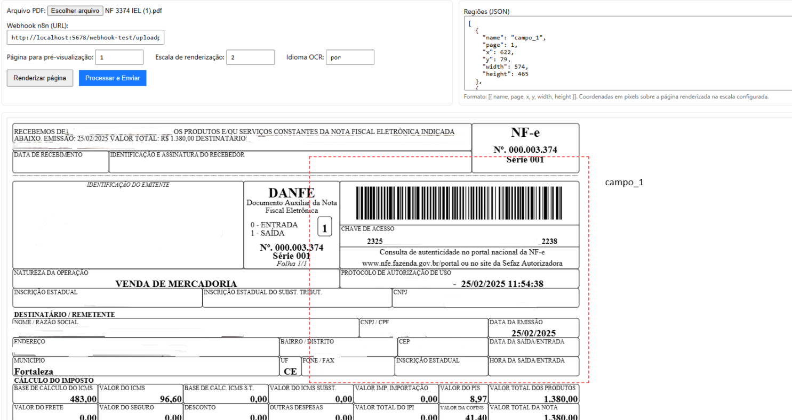
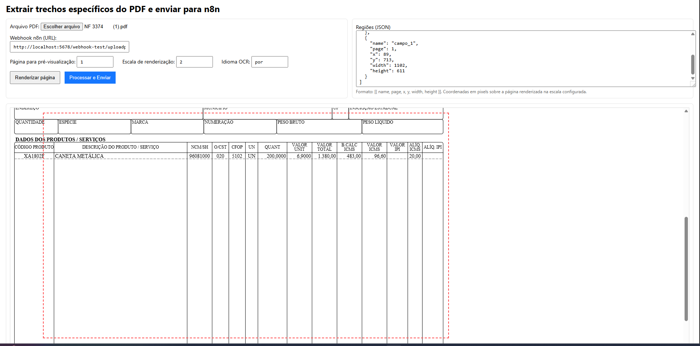

## Import NFe PDF → Coordinate-based Extraction + n8n

This project was built specifically to read Brazilian invoice PDFs (NFe). It extracts selected sections from the document and sends them to an n8n workflow, where data is validated, enriched, and merged. It consists of:

- `index.html`: a visual tool to mark PDF regions and trigger the n8n webhook
- `importar NF PDF.json`: the n8n workflow that receives the processed PDF data, validates, and organizes it

### High-level overview

1. The user loads a PDF in `index.html` and draws boxes on the regions of interest.
2. The front end first tries to read native PDF text from those regions; if none is present, it falls back to OCR (Tesseract.js).
3. The front end sends a JSON with the extracted fields to the n8n webhook.
4. The n8n workflow:
   - Extracts the access key, invoice number, CNPJ, issue date, and issuer
   - Uses an LLM agent (Groq) to structure products and amounts
   - Checks for nulls, validates, and merges into a final output

### How the n8n flow works (key points)

1. `Webhook` receives `{ results }` produced by the front end.
2. `Capturar chave` uses regex to extract the access key, date, number, and CNPJ from text and queries ReceitaWS to get the issuer trade/legal name.
3. `AI Agent` (Groq) takes the relevant field (e.g., `results.campo_2`) and—via a strict prompt—turns free text into a JSON list of line items in the format `{ produto, valor_unitario, quantidade, valor_total }`.
4. `Verificar Nulos` normalizes the agent output (fixes brackets, removes breaks, performs `JSON.parse`).
5. `If` ensures mandatory fields exist for at least one item; if something is missing:
   - `Sinalizador de erros` prepares `params` with missing/incorrect values and feeds them back to the `AI Agent`, creating a corrective loop until the structure is valid.
6. `Merge` combines structured items with invoice metadata (key, number, CNPJ, issue date, issuer).
7. `Code` presents the consolidated result for downstream consumption.

This design uses AI specifically to identify and structure NFe line items from semi‑structured text, enforcing coherence rules (for example, `valor_unitario * quantidade === valor_total`).

### Requirements

- Modern web browser (to open `index.html`)
- n8n running (local or remote)
- Groq account and credential configured in n8n (model referenced in the flow)

### Running the front end

1. Open `index.html` in your browser.
2. Choose an NFe PDF in “Arquivo PDF”.
3. Click “Renderizar página” to preview.
4. Draw regions directly on the page (click and drag). Regions are recorded in the JSON textarea at the right.
5. Set the n8n webhook URL in “Webhook n8n (URL)”. Default: `http://localhost:5678/webhook-test/uploadpdf`.
6. Click “Processar e Enviar”. The front end will post a JSON like `{ results: { campo_1: "...", campo_2: "..." } }` to n8n.

Notes:

- The front end first attempts native PDF text; if unavailable, it runs OCR with Tesseract.js.
- The regions JSON supports: `name`, `page`, `x`, `y`, `width`, `height` and optional `pad`, `whitelist`, `psm`.

### Importing and using the n8n workflow

1. In n8n, import `importar NF PDF.json`.
2. Configure the Groq credential referenced by the “Groq Chat Model” node.
3. Publish or test the “Webhook” node at route `uploadpdf`.
4. Trigger the front end (`index.html`) pointing the “Webhook n8n (URL)” field to your n8n URL.
5. Watch the execution: nodes capture key/CNPJ/date/issuer, extract and normalize products, check nulls, and perform the final merge.

Expected output includes:

- `chave`, `numero`, `cnpj`, `emissao`, `emitente`
- `produtos`: a list of objects `{ produto, valor_unitario, quantidade, valor_total }`

### Main nodes in the flow

- `Webhook`: receives `{ results }` from the front end
- `Capturar chave`: finds access key, CNPJ, date, number; queries ReceitaWS for issuer
- `AI Agent` (Groq): structures product items per prompt rules
- `Verificar Nulos` + `If`: validates presence of required fields
- `Sinalizador de erros`: feedback loop when inconsistencies are found
- `Merge` → `Code`: consolidates and presents output

### Images

Place the following images under `docs/` so they render in the README:

```text
docs/fluxon8n.png   ← n8n flow diagram
docs/outputn8n.png  ← example structured output
docs/front1.png     ← front end: region selection
docs/front2.png     ← front end: send & results
```





### Front-end screenshots





### Repository structure

```text
importar pdf nfe/
├─ index.html               # UI to mark regions and send to n8n
├─ importar NF PDF.json     # n8n workflow (import directly)
└─ README.en.md
```

### Tips & troubleshooting

- If a region returns empty text, increase the preview `scale` and/or use `pad` in the region.
- OCR quality: tune `psm` (Page Segmentation Mode) and `whitelist` when you know the character set.
- Ensure CORS/network allows the browser POST to your n8n instance.
- If ReceitaWS rate-limits requests, add caching or switch to another reliable source.

### License

Free for study and proof‑of‑concept use. Assess legal and privacy requirements when processing fiscal documents.


